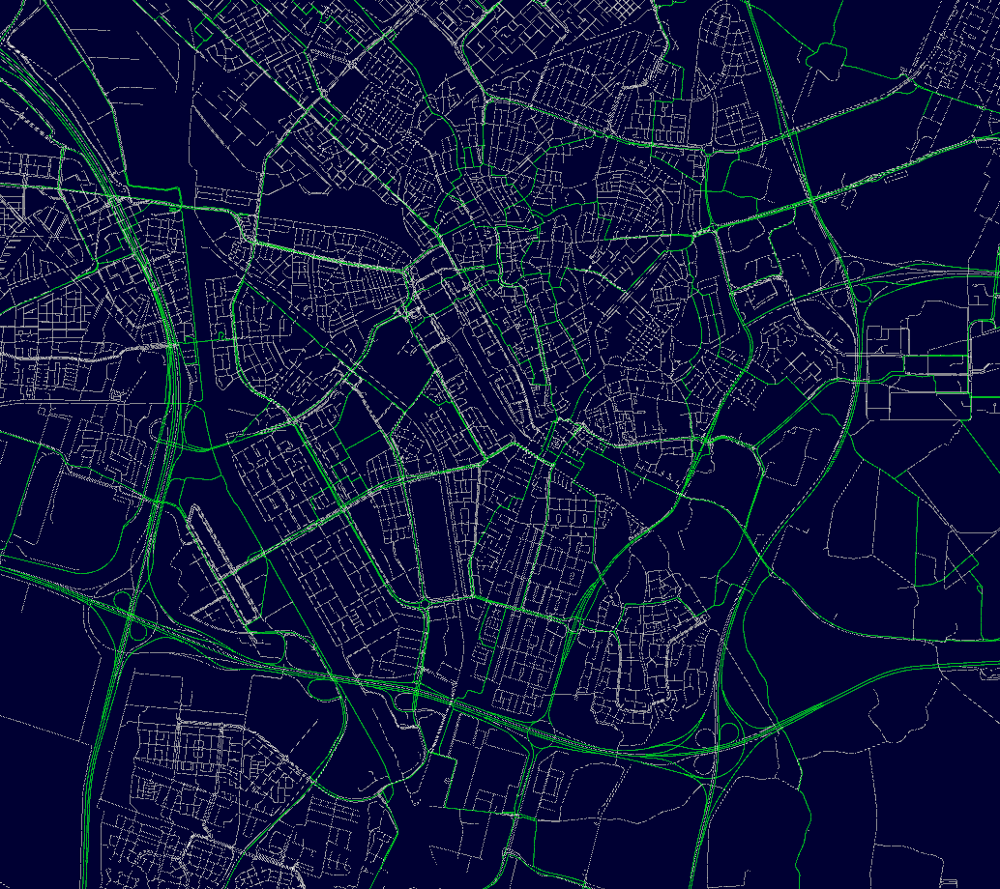

# Dutch roads



## Install:

1. Retrieve latest data from https://www.rijkswaterstaat.nl/apps/geoservices/geodata/dmc/nwb-wegen/geogegevens/shapefile/Nederland_totaal/
2. Extract contents to /data folder.
3. Create a database using the tools/dbf_to_sql tool. (`cargo.exe run --package dbf_to_sql --bin dbf_to_sql --release`)
4. Copy database to data/database.db

## Structure:

### Visualization

- main package: Uses bevy for visualization (using weird stuff)
- bevy_shapefile: Load spatial data for visualization

## Changes:

Changed old neighbourhood using hashmap to new neighbourhood using radius:

| Ver | Old | Old  | New | New  |
| --- | --- | ---- | --- | ---- |
| N   | 4   | 30   | 4   | 30   |
| ms  | 696 | 4453 | 452 | 3682 |

Phase 1 generation:

```
time:   [20.726 s 22.190 s 23.603 s]
```

### Changed custom graph to petgraph: Result is that it now is slower.

One of the reasons is that we are trying to keep things stable.
They need to be stable because we are removing nodeindeces from the network.
We can change this by not removing the node, but by removing the edges. Edges do not need to be stable.

Another reason is the edge layout. We need to quickly:
- Iterate over outgoing edges
- Iterate over incoming edges
- Iterate over outgoing+incoming edges
- get outgoing edge count
- get incoming edge count
- get total edge count

## Types

- VWG (Ventweg)
- PAR (Parallelweg - niet ventweg)
- MRB(Minirotondebaan)
- NRB (Normale rotondebaan - niet minirotondebaan)
- OPR (Toerit - synoniem: oprit)
- AFR (Afrit)
- PST (Puntstuk = snijpunt verharding)
- VBD (Verbindingsweg direct)
- VBI (Verbindingsweg indirect)
- VBS (Verbindingsweg semi-direct)
- VBR (Verbindingsweg rangeerbaan)
- VBK (Verbindingsweg kortsluitend)
- VBW(Verbindingsweg - overig)
- DST (Doorsteek)
- PKP (Verzorgingsbaan van/naar parkeerplaats)
- PKB (verzorgingsbaan van/naar parkeerplaats bij benzinestation)
- BST (Verzorgingsbaan van /naar benzinestation)
- YYY (Overige baan)
- BU(Busbaan)
- FP (Fietspad)
- HR (Hoofdrijbaan)
- TN(Tussenbaan)
- VP(Voetpad)
- OVB (OV-baan)
- CADO (Calamiteiten doorgang)
- TRB (Turborotondebaan)
- RP(Ruiterpad)
- VV (Vliegverkeer)
- PP (Parkeerplaats)
- PC(Parkeerplaats tbv carpool)
- PR(Parkeerplaats P+R)
- VD (Veerdienst)
- (Geen)
